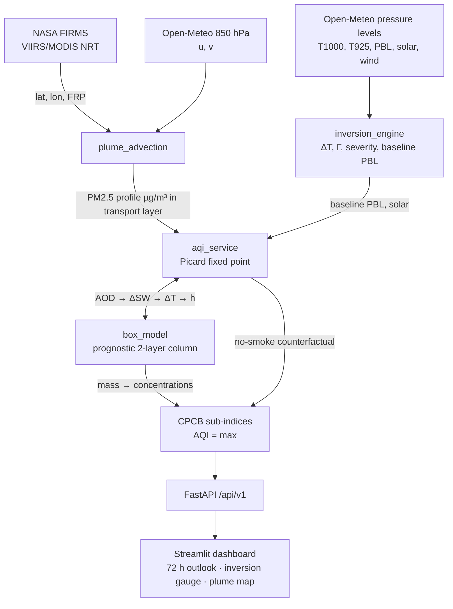

# Architecture — Delhi NCR Coupled AQI Forecast

## What this is, and what it is not

This is a **physics-informed single-column surrogate**: a prognostic box model of
the Delhi boundary layer, driven by forecast meteorology, with a genuine two-way
coupling between aerosol load and mixing depth. It runs a 72-hour forecast in
under two seconds on one container.

It is **not** a chemistry transport model. There is no horizontal grid, no
advection between cells, no gas-phase mechanism, no aerosol microphysics. Where
WRF-Chem solves the coupled equations on a 3-D mesh, this solves a
volume-averaged version of the same balance for one column and parameterises
everything it cannot resolve.

**On accuracy: no error figure is quoted anywhere in this document.** The
emission fluxes, background concentrations and feedback coefficients were
hand-set so the column reproduces the order of magnitude and the diurnal shape
of CPCB Delhi monthly climatology. They have not been fitted to observations,
and the model has not been scored against a withheld set. Any MAE, R², or
"percent of variance captured" claim about this system would be fabricated
unless it is produced by code in `backend/tests/` or `scripts/verify/` against
data the model never saw. Previous revisions of this file did quote such numbers;
they were invented and have been removed.

---

## The core problem this design solves

Delhi's winter episodes are an **accumulation** phenomenon, not a dilution one.

The obvious approach — scale emissions by `reference_PBL / actual_PBL` — is a
steady-state assumption, and it cannot represent trapping. It gives the same
concentration at hour 1 and hour 9 of an inversion, whereas the whole point of
an inversion is that pollution keeps building while the lid holds. It also gets
the diurnal shape wrong, because Delhi's morning peak and afternoon minimum come
from the mixed layer growing into pollution stranded aloft the previous night,
which requires a **memory** of what sits above the boundary layer.

So the state variable is column mass, the layer depth moves, and the history
matters.

---

## Two-reservoir prognostic column

`physics/box_model.py`

```
        ┌───────────────────────────────┐
        │      free troposphere         │   regional background (+ smoke)
   h_res├───────────────────────────────┤
        │      RESIDUAL LAYER           │   mass r [µg/m²]
        │      (no deposition)          │   stranded pollution lives here
      h ├───────────────────────────────┤
        │      MIXED LAYER              │   mass m [µg/m²],  C = m/h
        │      uniformly mixed          │
        └───────────────────────────────┘
                 emission E [µg/m²/s]
```

State is **column mass in µg/m², not concentration**, because mass is what is
conserved when the lid moves. Each hourly step:

1. **Emit** into the mixed layer: `m += E · Δt`
2. **Relax** toward the regional background, first-order, timescale τ
3. **Move the lid**:
   - `h` grows → entrain the residual layer first, then air from above it.
     This is the morning fumigation peak.
   - `h` shrinks → mass above the new lid is **stranded** into the residual
     layer and does not come back until the layer grows again.

Step 3 is what makes the model path-dependent, and path-dependence is what lets
an inversion actually trap.

### Removal timescale

```
1/τ = 1/τ_deposition + U/L          L = 40 km (Delhi NCT scale)
```

A calm night has a long residence time; a windy afternoon a short one. The wind
field does real work here rather than only being drawn on the dashboard. The
residual layer drops the deposition term — aerosol aloft is not in contact with
the ground.

The column relaxes toward a **regional background, not toward zero**: air
advected into Delhi is already polluted, so ventilation cannot clean below the
Indo-Gangetic Plain background.

### Species

| Species | τ_deposition | Rationale |
|---|---|---|
| PM2.5 | 48 h | fine mode deposits slowly |
| PM10 | 12 h | coarse mode settles fast |
| NO2 | 8 h | photochemically short-lived |
| SO2 | 36 h | oxidises over ~1.5 days |
| CO | 240 h | effectively inert; ventilation-limited |

O3 is **not** carried by the box model. Its lifetime is short and it is produced
in situ rather than emitted, so it is diagnosed each hour from the shortwave flux
that actually reaches the surface, minus NO titration.

---

## Two-way coupling

`services/aqi_service.py::_solve_coupled_hour`

The mixing depth and the aerosol load each determine the other, so each hour is
a fixed-point problem solved by **Picard iteration with 0.6 under-relaxation**
(the map is monotone and oscillates without it). Convergence tolerance is 1 m of
mixing depth; typical cost is 1–6 iterations, hard cap 12.

```
                  ┌─────────────────────────────────────┐
                  │  h  (trial mixing depth)            │
                  └──────────────┬──────────────────────┘
                                 │
                    box_model.step on a CLONE
                                 │
                                 ▼
                        PM2.5 concentration
                                 │
              AOD = MEE · 1.5 · C · h          MEE = 8 m²/g
                                 │
              ΔSW = −solar_actual · min(0.45, 0.13 · AOD)
                                 │
              ΔT_surface = 0.02 K per W/m²
                                 │
              cooling_eff = max(this hour, thermal memory)
                                 │
              h_target = h_baseline · exp(−0.15 · cooling_eff)
                                 │
                     under-relax, repeat until |Δh| < 1 m
                                 └──────────────► commit ONE real step
```

Only a **clone** is trial-stepped while searching for the depth; exactly one real
step is committed at the converged depth, so the prognostic mass budget stays
exact no matter how many iterations the solver takes.

### Three details that make this defensible

**Gating on actual insolation.** `shortwave_reduction` multiplies by the real
incoming flux, so at night it returns exactly zero. An earlier version used a
constant W/m² per unit AOD and therefore "cooled" the surface at 02:00.

**Surface thermal memory.** Aerosol dimming during the day leaves the surface
colder at sunset, which strengthens the following nocturnal inversion. This is
carried by a one-pole filter with τ = 8 h. Without it the shortwave-driven
feedback would be identically zero at night — precisely the regime Delhi's
episodes occur in, which would make the coupling useless for this problem.

**`pbl_from_stability()` is the identity at zero forcing.** It is the only place
a PBL height is ever perturbed. The baseline and perturbed depths therefore come
from the same function, and their difference is a real feedback signal rather
than an artefact of comparing two different parameterisations.

### Measured feedback strength

Computed by running the identical column twice, once with the radiative leg
disabled (`attrib.py`):

| Scenario | PM2.5 daily mean | AQI daily mean | Max hourly ΔAQI |
|---|---|---|---|
| August (monsoon) | +2.2% | +1 | +2 |
| November (inversion episode) | +6.0% | +13 | +40 |
| November + 60 µg/m³ plume | +6.8% | +10 | +18 |

The seasonal contrast is the point: the coupling is nearly silent in clean,
well-ventilated air and matters most under a shallow winter lid. A feedback that
fired equally in both would be a bug.

---

## Inversion diagnostics

`physics/inversion_engine.py`

```
ΔT = T(925 hPa) − T(1000 hPa)        ΔT > 0  ⇒  warm lid aloft
Γ  = −ΔT / 0.75 km                   negative Γ = inverted
```

Severity bands: None < 1.5 °C ≤ Weak < 3.5 °C ≤ Moderate < 6.0 °C ≤ Strong.
These are classification bands from the Indian boundary-layer literature, not
fitted values.

Mixing depth comes from Open-Meteo's `boundary_layer_height` whenever the field
is present. `_suppressed_pbl(ΔT)` is a fallback for missing hours **only** —
using it to perturb an observed PBL was a bug, and the function's docstring says
so. Floor is 150 m: Delhi's winter nocturnal PBL is routinely 100–200 m, and
below that a uniformly-mixed box stops being meaningful.

`amplification_factor` (= 1200 m / h, bounded to [0.25, 6.0]) is retained as a
**reported diagnostic** so the dashboard can show how compressed the layer is.
It is no longer the mechanism that produces concentrations — the box model is.

---

## Stubble plume transport

`physics/plume_advection.py`

Every stage of this module was rebuilt; see the commit message for the five
independent faults that meant it could not previously produce a single plume.

**Emission.** The standard FRP chain, not a tuned coefficient:

```
FRP [MW] → dry matter at 0.368 kg/MJ        (Wooster et al. 2005)
         → PM2.5 at 8.5 g/kg                (Andreae & Merlet, crop residue)
         = 3.13 g PM2.5 per second per MW
```

A 20,000 MW aggregate burning day gives ~5,400 t PM2.5/day, in line with
published inventories for the Punjab–Haryana paddy-residue window.

**Transport.** Hourly Lagrangian forward trajectory on the 850 hPa wind, 72
steps. Delhi is projected onto each hourly **segment**, not just tested against
the waypoints, so a fast plume crossing the city between two samples still
registers. (Sampled 6-hourly, as the old code did, a 20 m/s plume passing
directly overhead reported a 197 km miss.)

**Dispersion.** Pasquill-Gifford Class D near the source; **Heffter (1965)**,
`σy = 0.5 m per second of travel`, at long range, taken as `max(P-G, Heffter)`.
P-G extrapolated to 300 km gives a 9 km-wide plume — far outside its ~20 km
calibration range, and narrow enough to make an entire burning region invisible
to the city. The two forms cross almost exactly at the P-G validity limit, so the
transition needs no tuned switch point. Result: 32 km at 300 km / 18 h, matching
observed regional plume widths.

**Coupling.** `plume_column_loading` returns a **column loading in µg/m²** using
the vertically-trapped Gaussian limit, deliberately independent of the receptor
mixing depth. The box model applies depth once, where it belongs. Advected smoke
enters as an **elevated regional background**, not a surface flux — that is what
material arriving aloft physically is, and it makes entrained residual-layer air
smoky too. Only 40% is felt in the mixed layer directly; the rest reaches the
ground when the boundary layer grows into it next morning, which is the observed
fumigation signature of a transport episode.

**Attribution** is a no-smoke **counterfactual run** through the identical code
path, replacing a subtraction that ignored mixing depth, entrainment history and
ventilation. It is skipped entirely when there are no fires, so the common case
costs nothing.

**No synthetic fires.** `_synthetic_hotspots()` was deleted rather than repaired.
Fabricated detections would put invented data on a map that users read as
observations. When FIRMS is unavailable the hotspot list is empty and the
dashboard says so.

---

## Data flow



A **24-hour spin-up pass** runs before hour 0 and is discarded, so the forecast
does not open on a cold start with the column sitting at background.

---

## AQI computation

`services/aqi_service.py`

**CPCB National AQI (2014)** — linear interpolation inside the breakpoint
segment containing the concentration, then `AQI = max(sub-indices)`:

```
I = I_lo + (I_hi − I_lo) · (C − C_lo) / (C_hi − C_lo)
```

The `/realtime` endpoints additionally support **US EPA (2012) breakpoints with
NowCast** weighting, with concentrations truncated to reporting precision before
lookup as the EPA method requires.

Note on the unreachable branch in `_linear_interpolate_subindex`: CPCB segments
are contiguous, so a value should always match one. If it somehow does not, the
function snaps up to the next segment floor rather than silently returning 500 —
an earlier version reported Severe for values that merely fell in a rounding gap.

**Diurnal emissions.** Aerosol and traffic profiles differ deliberately. Traffic
NOx and CO collapse overnight; PM does not, because residential biomass and
waste burning run late through the Delhi winter and heavy goods vehicles are only
permitted after 23:00. The hour passed in **must already be IST** — Open-Meteo is
queried with `timezone=Asia/Kolkata`, so adding an offset on top slid the whole
cycle by five hours and put the morning rush at 02:00.

**Seasonality.** PM2.5 follows CPCB monthly climatology (deep monsoon minimum
~30% of the Nov/Dec peak, sharp October rise). PM10 is flatter with a secondary
pre-monsoon dust maximum. Gases barely vary — their observed seasonal swing is
mostly dilution, which the box model already supplies.

---

## Verification

Two layers. `backend/tests/` is the assertion suite: **149 tests across six files**
(`test_aqi_scales`, `test_box_model`, `test_coupling`, `test_diurnal_seasonal`,
`test_inversion_kernels`, `test_plume`) pinning the edges of every fix — exact mass
conservation, the two-way feedback measured against its no-feedback counterfactual,
the diurnal profile's rush hours, the EPA gap that used to read "Severe", the FRP
chain and wind sign convention. They run under `pytest`, or under
`python backend/tests/run_without_pytest.py` where the package index is unreachable
and pytest cannot be installed. `scripts/verify/` holds numerical harnesses that
print computed values for a human to argue with; each is runnable from anywhere with
`python scripts/verify/<name>.py` and exits non-zero if a behavioural check fails:

- `calib.py` — diurnal and seasonal shape against CPCB climatology. Current
  output: August PM2.5 19/28/41 µg/m³ (min/mean/max), AQI 46–127; November
  96/221/342, AQI 220–437. No saturation at AQI 500 anywhere.
- `attrib.py` — feedback strength via the disabled-leg counterfactual (table
  above).
- `plumecheck.py` — seven sections covering the emission chain, σy growth,
  direction-awareness (328 µg/m² aimed at Delhi vs 0.0 blowing away and 0.0
  perpendicular), segment-aware closest approach, FIRMS parsing for both VIIRS
  and MODIS layouts, state labelling, and aggregate magnitude across quiet /
  moderate / peak burning days.
- `windcheck.py` — the wind sign convention end to end: direction→velocity for
  five compass cases, the fallback constant's bearing, the velocity→direction
  round trip, and three prescribed-wind trajectories (a wind on the
  Ludhiana→Delhi bearing closes to 6 km at +21 h; the reverse wind never
  approaches at all).

None of this is an accuracy measurement. It checks signs, monotonicity, mass
conservation and seasonal contrast — that the model behaves the way the physics
says it should. Scoring it requires a backtest against observations the model
never saw, which does not exist in this repository yet.

Every physics constant in the source carries a docstring stating its provenance
and observed range. Where a value is hand-set rather than derived, the docstring
says that too.

---

## Scaling and higher fidelity

- Caching today is an in-process `TTLCache` (5 min instant / 60 min NowCast) in
  `realtime_service.py`, and the rate limiter is in-memory too. That is why the
  container runs `--workers 1`: two workers would keep divergent caches and
  double the load on OpenAQ. Moving both to Redis is the prerequisite for
  raising the worker count — earlier revisions of this file described Redis
  caching as "configured, optional", but nothing ever connected to it, and the
  service has been removed from `docker-compose.yml`.
- FastAPI request handling is otherwise stateless.
- For higher fidelity: replace the hand-set emission fluxes in
  `box_model.SPECIES` with a gridded inventory, and replace Open-Meteo's
  boundary layer height with ERA5 reanalysis or a WRF run. The column solver
  itself does not change — it consumes a PBL time series and an emission flux,
  whatever produces them.
