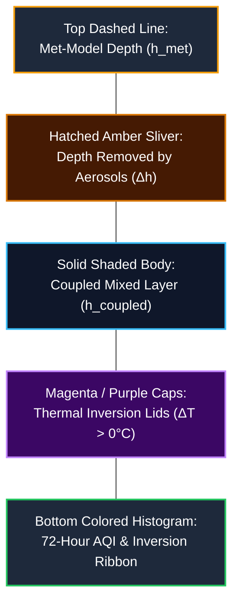

# In-Depth Scientific & Technical Guide: The Atmosphere & Boundary Layer Section
## *"The Layer the Air is Trapped In" — Atmospheric Volume, Thermal Inversions, and Aerosol Suppression*

---

## 1. Core Philosophy: Why is Air Pollution a "Volume Problem"?

Most people assume air quality depends purely on how many cars are driving or how many factories are running (**Emissions Flux $E$**). However, emissions in Delhi NCR vary by only **$\sim 15\%\text{ to }30\%$** between summer and winter, yet winter surface pollution surges by **$500\%\text{ to }1000\%$ (10x worse)**!

### The Atmospheric Physics Law of Volume:
Air pollutant concentration ($C$) inside a well-mixed boundary layer follows the fundamental volume relationship:
$$C = \frac{\text{Emissions Mass Rate} \times \text{Residence Time}}{\text{Urban Area} \times \text{Mixing Depth } (h)}$$
$$C \propto \frac{1}{h}$$

- **In Summer (Deep Layer: $h \approx 2500\text{--}3000\,\text{m}$)**: Emissions are diluted across a massive vertical volume. Air stays relatively clear.
- **In Winter (Shallow Layer: $h \approx 150\text{--}200\,\text{m}$)**: The exact same amount of traffic and industrial smoke is compressed into a tiny vertical sliver, causing concentrations to spike into the **Severe / Hazardous** range.

> *"Delhi's pollution is a volume problem before it is an emissions problem. The same source strength gives twice the concentration in a mixed layer half as deep."*

---

## 2. Visual Architecture: Decoding Every Element in the Chart

The chart visualized in this section is a **72-hour continuous atmospheric profile** that plots the vertical depth of Delhi's atmosphere alongside the feedback loop and resulting AQI.



---

### 1. The Solid Shaded Body (`MIXED LAYER`)
* **What it represents**: The **Coupled Mixed Layer Height ($h_{\text{coupled}}$ in meters)** from ground level ($0\,\text{m}$) to the boundary layer ceiling over 72 hours.
* **Diurnal Breathing Pattern**:
  - **Nighttime Collapse ($00:00\text{--}06:00\,\text{AM}$)**: Ground radiative cooling shuts down convective thermals. The layer compresses to **$150\text{ to }250\,\text{m}$**.
  - **Daytime Convective Growth ($11:00\text{ AM}\text{--}04:00\,\text{PM}$)**: Solar radiation heats the asphalt and soil, generating buoyant thermals that lift the lid to **$1200\text{ to }1600\,\text{m}$**.
* **Haze Shading**: The gradient tint inside this body darkens and shifts from cool mist to warm ochre based on real-time $\text{PM}_{2.5}$ loading.

---

### 2. The Hatched Amber Sliver (`REMOVED BY AEROSOL`)
* **What it represents**: The **vertical depth of atmospheric breathing lost due to smog dimming ($\Delta h = h_{\text{met}} - h_{\text{coupled}}$)**.
* **Why it is the most critical visual in the project**:
  - This hatched area is the visual proof of **Two-Way Coupling ("The Return Leg")**.
  - Without air pollution, the atmosphere would expand all the way to the upper dashed line ($h_{\text{met}}$).
  - Because particulate matter blocked sunlight and cooled the ground by $-0.5^\circ\text{C}\text{ to }-2.0^\circ\text{C}$, thermal buoyancy was suppressed, stealing **$100\text{ to }350\,\text{meters}$** of clean mixing volume!
  - **Mathematical Definition**:
    $$\Delta h = h_{\text{met}} \times \left(1 - \exp\left(-\lambda \cdot \Delta T_{\text{surface}}\right)\right)$$

---

### 3. The Dashed Golden Line (`MET-MODEL DEPTH`)
* **What it represents**: The **uncoupled, raw meteorological boundary layer height ($h_{\text{met}}$)** forecasted by European numerical weather prediction models (Open-Meteo / ECMWF) before accounting for aerosol radiative cooling.

---

### 4. The Thermal Inversion Caps (`INVERSION`, Magenta / Violet Caps)
* **What it represents**: A rigid atmospheric "warm lid" formed when upper air is warmer than surface air ($\Delta T = T_{925\,\text{hPa}} - T_{1000\,\text{hPa}} > 0^\circ\text{C}$).
* **Lapse Rate & Inversion Severity**:
  $$\text{Environmental Lapse Rate } (\Gamma) = -\frac{T_{925\,\text{hPa}} - T_{1000\,\text{hPa}}}{\Delta z} \quad (\Delta z \approx 0.75\,\text{km})$$
  - Under normal conditions, air cools with height ($\Gamma > 0$, warm air at bottom rises freely).
  - During an inversion ($\Gamma < 0$), cold dense air is trapped underneath warm light air, creating a **zero-vertical-motion ceiling** that locks smog in place.
* **Classification Scale**:
  - $\Delta T < 1.5^\circ\text{C}$: **None / Normal**
  - $1.5^\circ\text{C} \le \Delta T < 3.5^\circ\text{C}$: **Weak Inversion**
  - $3.5^\circ\text{C} \le \Delta T < 6.0^\circ\text{C}$: **Moderate Inversion**
  - $\Delta T \ge 6.0^\circ\text{C}$: **Strong Inversion**

---

### 5. The Bottom 72-Hour AQI Ribbon & Interactive Cursor
* **What it represents**: The resulting hourly **Indian National Air Quality Index (AQI)** calculated from CPCB sub-index breakpoints.
* **CPCB Color Palette**:
  - `0 – 50`: **Good** (`#8ceb8c`)
  - `51 – 100`: **Satisfactory** (`#ffff00`)
  - `101 – 200`: **Moderate** (`#ff9900`)
  - `201 – 300`: **Poor** (`#ff6666`)
  - `301 – 400`: **Very Poor** (`#af52de`)
  - `401 – 500`: **Hazardous** (`#800000`)
* **Timeline Cursor**: Users can drag the cursor across all 72 hours, press **"Sweep 72 h"** to play an animated time-lapse, or press **"Now"** to jump to the live hour. Every card, chart, and map on the website updates in real time to match the scrubbed hour.

---

## 3. Mathematical & Algorithmic Chain

```
[Open-Meteo Pressure Soundings: T1000, T925, PBL]
                       │
                       ▼
         [Inversion Engine Diagnostics]
         • ΔT = T925 - T1000
         • Lapse Rate Γ = -ΔT / 0.75 km
         • Inversion Severity Classification
                       │
                       ▼
        [Two-Way Coupled Box Model (Step)]
         • Mass Conservation: dm/dt = E - Loss + Entrainment
         • Surface PM2.5 = m_mixed / h_coupled
                       │
                       ▼
       [Aerosol Radiative Cooling Kernel]
         • Column AOD = MEE × 1.5 × PM2.5 × h
         • Solar Dimming ΔSW = -SW_in × (0.13 × AOD)
         • Surface Cooling ΔT_surf = ΔSW × 0.02 K/(W/m²)
                       │
                       ▼
        [Picard Fixed-Point Iteration]
         • h_target = h_met × exp(-0.15 × ΔT_surf)
         • Convergence: |h_next - h| < 1.0 m
                       │
                       ▼
  ┌────────────────────┴────────────────────┐
  ▼                                         ▼
[Solid Body: h_coupled]        [Hatched Sliver: Δh]
```

---

## 4. Summary Table of Atmospheric Quantities

| Parameter | Unit | Physical Meaning | Formula / Derivation |
| :--- | :---: | :--- | :--- |
| **$h_{\text{met}}$** | $\text{m}$ | Baseline weather model boundary layer height | Open-Meteo `boundary_layer_height` |
| **$h_{\text{coupled}}$** | $\text{m}$ | Actual mixing depth after aerosol cooling | $h_{\text{met}} \times \exp(-0.15 \cdot \Delta T_{\text{effective}})$ |
| **$\Delta h$** | $\text{m}$ | Vertical depth removed by smog dimming | $h_{\text{met}} - h_{\text{coupled}}$ |
| **$\Delta T_{\text{inv}}$** | $^\circ\text{C}$ | Temperature difference ($925\,\text{hPa} - 1000\,\text{hPa}$) | $T(925\,\text{hPa}) - T(1000\,\text{hPa})$ |
| **$\Gamma$** | $\text{K/km}$ | Environmental vertical lapse rate | $-\Delta T_{\text{inv}} / 0.75\,\text{km}$ |
| **AQI** | $0\text{--}500$ | National Air Quality Index | Maximum pollutant sub-index across CPCB breakpoints |

---

## 5. Summary Presentation Takeaway

> **"This section proves that air pollution is governed by atmospheric geometry. When a thermal inversion puts a warm lid at 200 meters, Delhi's emissions have nowhere to go. Furthermore, the hatched amber sliver proves that pollution actively shrinks its own room by blocking the sun, transforming a normal winter day into a self-reinforcing pollution trap."**
