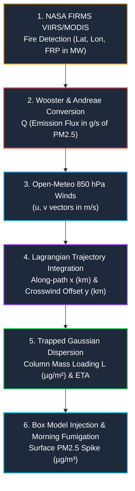

# In-Depth Scientific & Technical Guide: Dynamic Transport & Plume Advection
## *Lagrangian Trajectory Advection, 850 hPa Wind Steering, and Stubble Smoke Dispersion*

---

## 1. Executive Summary: What is Dynamic Transport?

Every autumn (October–November), post-monsoon harvesting in the agricultural states of **Punjab, Haryana, and Western Uttar Pradesh** leads to widespread burning of paddy crop residue (rice straw). 

Traditional air quality systems either ignore regional transport or assign a static, unverified flat percentage to biomass burning. Our system implements **Dynamic Lagrangian Transport & Plume Advection**:
- Ingests **real-time thermal anomaly detections** from NASA satellites.
- Converts Fire Radiative Power ($\text{FRP}$) into physical $\text{PM}_{2.5}$ emission fluxes.
- Advects each plume forward hour-by-hour using **850 hPa upper-air steering wind vectors**.
- Computes **along-path travel times (ETA)**, **Gaussian crosswind dispersion**, and **decay**.
- Calculates the exact **column mass loading ($\mu\text{g}/\text{m}^2$)** arriving over Delhi NCR and simulates its morning fumigation down to the surface.

---

## 2. The Complete 6-Stage Physical & Mathematical Chain

---

### Stage 1: Satellite Thermal Anomaly Detection (NASA FIRMS)
* **Source Code**: `fetch_firms_hotspots()` in [`backend/app/physics/plume_advection.py`](file:///c:/Users/aswin/Downloads/delhi_ncr_aqi_project%20%281%29/backend/app/physics/plume_advection.py)
* **Instruments Used**:
  - **VIIRS** (Visible Infrared Imaging Radiometer Suite on Suomi-NPP / NOAA-20): $375\,\text{m}$ spatial resolution.
  - **MODIS** (Moderate Resolution Imaging Spectroradiometer on Terra / Aqua): $1\,\text{km}$ resolution.
* **Geographical Bounding Box**:
  - West: $73.0^\circ\text{E}$, South: $27.5^\circ\text{N}$, East: $78.5^\circ\text{E}$, North: $32.6^\circ\text{N}$
  - Encompasses Punjab, Haryana, Northern Rajasthan, and Western UP.
* **Extracted Attributes**: Fire location $(\text{Lat}, \text{Lon})$, Acquisition Time, Confidence ($\%$), and **Fire Radiative Power ($\text{FRP}$ in $\text{MW}$)**.

---

### Stage 2: Fire Radiative Power (FRP) to $\text{PM}_{2.5}$ Emission Rate ($Q$)
* **Source Code**: `_PM25_UG_S_PER_MW` in [`backend/app/physics/plume_advection.py`](file:///c:/Users/aswin/Downloads/delhi_ncr_aqi_project%20%281%29/backend/app/physics/plume_advection.py)
* **Physics & Governing Derivation**:
  1. **Dry Matter Combustion Rate ($C_{\text{rate}}$)** (*Wooster et al., 2005*):
     $$\text{Combustion Rate} = 0.368\,\frac{\text{kg dry biomass}}{\text{MJ of radiated energy}}$$
     Since $1\,\text{MW} = 1\,\text{MJ/s}$, every Megawatt of fire power consumes $0.368\,\text{kg/s}$ of crop residue.
  2. **Crop-Residue Emission Factor ($\text{EF}_{\text{PM2.5}}$)** (*Andreae & Merlet, 2001; Indian Field Studies*):
     $$\text{EF}_{\text{PM2.5}} = 8.5\,\frac{\text{g PM}_{2.5}}{\text{kg dry matter}}$$
     (Indian rice-straw burning has a high smouldering fraction, leading to fine aerosol yields of $8.0\text{--}12.0\,\text{g/kg}$).
  3. **Total Source Emission Rate ($Q$)**:
     $$Q = \text{FRP} \times 0.368 \times 8.5 \times 10^6\,\frac{\mu\text{g}}{\text{s}\cdot\text{MW}} \approx 3.128 \times 10^6\,\frac{\mu\text{g}}{\text{s}\cdot\text{MW}} \quad (\approx 3.13\,\text{g/s per MW})$$

---

### Stage 3: Why We Use the 850 hPa Steering Wind Layer
* **Source Code**: `fetch_850hpa_wind()` in [`backend/app/physics/plume_advection.py`](file:///c:/Users/aswin/Downloads/delhi_ncr_aqi_project%20%281%29/backend/app/physics/plume_advection.py)
* **Atmospheric Altitude**: $850\,\text{hPa} \approx 1450\text{--}1550\,\text{m}$ Above Ground Level (AGL).
* **Physical Justification**:
  1. **Thermal Plume Rise**: Afternoon stubble fires create buoyant updrafts that inject smoke to the top of the convective mixed layer ($1.2\text{--}2.0\,\text{km}$).
  2. **Decoupling from Nocturnal Ground Inversion**: At night, while surface winds drop to near-calm ($<1\,\text{m/s}$), the smoke layer aloft is propelled rapidly by free-tropospheric winds.
  3. **Northwesterly Flow (NW)**: Delhi's autumn transport pathway is governed by synoptic northwesterly winds ($\theta \approx 300^\circ\text{--}330^\circ$, $u > 0$ eastward, $v < 0$ southward) with mean speeds of $3\text{--}8\,\text{m/s}$ ($10\text{--}30\,\text{km/h}$).

---

### Stage 4: Lagrangian Forward Trajectory Advection
* **Source Code**: `advect_plumes()` in [`backend/app/physics/plume_advection.py`](file:///c:/Users/aswin/Downloads/delhi_ncr_aqi_project%20%281%29/backend/app/physics/plume_advection.py)
* **Integration Scheme**:
  For each detected fire $i$, the plume parcel position $(x_t, y_t)$ advances each hour:
  $$\Delta x = u_{850} \cdot \Delta t, \quad \Delta y = v_{850} \cdot \Delta t$$
  $$\text{Lat}_{t+1} = \text{Lat}_t + \frac{\Delta y}{111.32\,\text{km/deg}}, \quad \text{Lon}_{t+1} = \text{Lon}_t + \frac{\Delta x}{111.32 \cdot \cos(\text{Lat}_t)\,\text{km/deg}}$$
* **Geometry Evaluated Against Delhi Receptor $(28.6139^\circ\text{N}, 77.2090^\circ\text{E})$**:
  1. **Along-Path Travel Distance ($x_{\text{travel}}$ in $\text{km}$)**.
  2. **Estimated Time of Arrival ($\text{ETA} = x_{\text{travel}} / U_{850}$)**: Punjab fires ($\sim 280\,\text{km}$ northwest) take **$16\text{ to }28\,\text{hours}$** to arrive over Delhi; Haryana fires ($\sim 100\text{--}160\,\text{km}$) arrive in **$8\text{ to }14\,\text{hours}$**.
  3. **Crosswind Miss Distance ($y_{\text{crosswind}}$ in $\text{km}$)**: The closest approach distance between the plume centerline trajectory and Delhi. Plumes blown toward the southeast hit Delhi directly ($y \approx 0$), while plumes steered toward Nepal or Rajasthan miss Delhi and are exponentially dampened.

---

### Stage 5: Long-Range Trapped Gaussian Dispersion
* **Source Code**: `plume_column_loading()` in [`backend/app/physics/plume_advection.py`](file:///c:/Users/aswin/Downloads/delhi_ncr_aqi_project%20%281%29/backend/app/physics/plume_advection.py)
* **Crosswind Horizontal Spread ($\sigma_y$)**:
  - Near-field ($<20\,\text{km}$): Pasquill-Gifford Class D power law.
  - Far-field ($20\text{--}300\,\text{km}$): **Heffter (1965) Long-Range Relation**:
    $$\sigma_y = \max\left(\sigma_{y,\text{PG}},\, 0.5\,\frac{\text{m}}{\text{s}} \times t_{\text{travel}}(\text{seconds})\right)$$
    *(At $20\,\text{hours}$ transit time, $\sigma_y \approx 36\,\text{km}$, matching real satellite smoke swath widths).*
* **Trapped Column Loading Formula ($L_{\text{column}}$ in $\mu\text{g}/\text{m}^2$)**:
  $$L_{\text{column}} = \frac{Q}{\sqrt{2\pi} \cdot \sigma_y \cdot U_{850}} \times \exp\left(-\frac{y_{\text{crosswind}}^2}{2\sigma_y^2}\right) \times \exp\left(-\frac{t_{\text{travel}}}{\tau_{\text{loss}}}\right)$$
  Where:
  - $\tau_{\text{loss}} = 72.0\,\text{hours}$ (wet scavenging / dry fallout during regional transit).
  - The equation calculates **Column Mass Loading ($\mu\text{g}/\text{m}^2$)** rather than a surface concentration, ensuring the receiving mixed-layer depth is not double-counted.

---

### Stage 6: Mixed vs Residual Layer Fumigation (Box Model Coupling)
* **Source Code**: `PLUME_DIRECT_FRACTION = 0.40` in [`backend/app/physics/box_model.py`](file:///c:/Users/aswin/Downloads/delhi_ncr_aqi_project%20%281%29/backend/app/physics/box_model.py)
* **The Atmospheric Fumigation Mechanism**:
  1. **Nighttime Transport**: Arriving stubble smoke slides over Delhi inside the **Residual Layer ($H \sim 1200\,\text{m}$)** above the cold, shallow nocturnal boundary layer ($h \sim 150\text{--}200\,\text{m}$).
  2. **Direct Partitioning**: Only $40\%$ ($\text{PLUME\_DIRECT\_FRACTION}$) penetrates the nocturnal surface layer directly.
  3. **Morning Fumigation Peak (08:00–11:00 AM)**: As the morning sun heats the ground, the convective mixed layer rapidly expands upward ($h$ grows from $200\,\text{m} \rightarrow 1000\,\text{m}$). The growing layer **entrains the massive smoke reservoir stranded aloft**, dumping it directly to ground level and causing the severe morning air quality spike!

---

## 3. Dynamic Transport vs Static Model Comparison

| Feature | Conventional Static AQ Models | Our Dynamic Transport Engine |
| :--- | :--- | :--- |
| **Fire Ingestion** | Fixed historical inventory or rough guess | **Live NASA VIIRS + MODIS Satellite Hotspots (FRP in MW)** |
| **Wind Steering** | Ground-level station anemometers (ground drag error) | **850 hPa Upper-Air Steering Wind Layer (Open-Meteo)** |
| **Trajectory** | Direction-blind distance radius | **Lagrangian forward step-by-step vector advection** |
| **Plume Geometry** | Homogeneous circular spread | **Direction-aware Gaussian plume with crosswind miss penalties** |
| **Arrival Timing** | Static daily averages | **Hourly dynamic ETA calculation ($t_{\text{travel}}$)** |
| **Vertical Structure** | Single uniform slab | **Two-reservoir (Mixed + Residual Layer) morning fumigation** |

---

## 4. Key Parameters & Literature Constants Summary

| Constant | Description | Value | Literature Reference |
| :--- | :--- | :---: | :--- |
| $\text{DM/FRP}$ | Dry matter burned per MJ radiated energy | $0.368\,\text{kg/MJ}$ | Wooster et al. (2005) |
| $\text{EF}_{\text{PM2.5}}$ | Emission factor for rice crop residue | $8.5\,\text{g/kg}$ | Andreae & Merlet (2001); CPCB IGP studies |
| $\sigma_y / t$ | Heffter horizontal expansion rate | $0.5\,\text{m/s}$ | Heffter (1965); HYSPLIT trajectory basis |
| $H_{\text{plume}}$ | Plume transport layer thickness | $1200.0\,\text{m}$ | Lidar sounding observations over Delhi |
| $\tau_{\text{loss}}$ | Regional atmospheric removal lifetime | $72.0\,\text{hours}$ | Regional aerosol transport lifetime |
| $f_{\text{direct}}$ | Fraction directly entering nocturnal mixed layer | $0.40$ | Residual layer partition constant |

---

## 5. Summary Takeaway

> **"Dynamic Transport models the real-world physics of smoke travel: fires burning in Punjab do not appear in Delhi instantly or isotropically. They travel as coherent Lagrangian plumes along 850 hPa wind streamlines over 16 to 28 hours, glide over the city at night in the residual layer, and fumigate the ground the following morning as convective heating breaks the inversion."**
