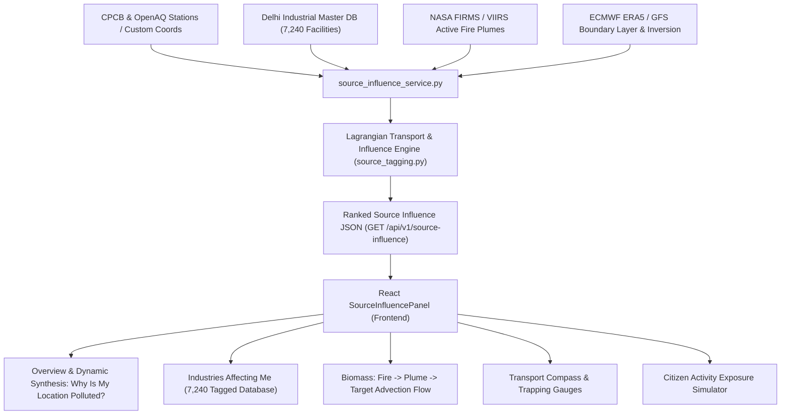

# NCR 72 — Location Intelligence: Source Influence System Documentation

## 1. Executive Summary & Scientific Positioning
The **Location Intelligence: Source Influence at Your Location** system provides an automated, physics-grounded diagnostic engine that identifies, tags, ranks, and visualizes industrial clusters and agricultural fire plumes affecting any coordinate or CPCB air monitoring station in the Delhi-NCR region.

### Non-Negotiable Scientific Positioning
All outputs produced by this subsystem are explicitly labeled and communicated as **Estimated Model Influence** ($[0, 1]$ relative downwind impact potential).
- **What it is:** A Lagrangian-heuristic transport model combining Haversine distance decay, bearing alignment to advection wind vectors, Planetary Boundary Layer (PBL) mixing suppression, and thermal inversion trapping multipliers.
- **What it is NOT:** It is **not** a chemically resolved source apportionment (such as Positive Matrix Factorization / PMF or isotopic carbon-14 dating), nor is it an exact stack-by-stack emission accounting system.

---

## 2. Mathematical Formulation & Physics Engine

### 2.1 Haversine Distance & Bearing Angle
For a target location $(\phi_t, \lambda_t)$ and source $(\phi_s, \lambda_s)$:
$$\Delta \phi = \phi_t - \phi_s, \quad \Delta \lambda = \lambda_t - \lambda_s$$
$$a = \sin^2\left(\frac{\Delta \phi}{2}\right) + \cos(\phi_s)\cos(\phi_t)\sin^2\left(\frac{\Delta \lambda}{2}\right)$$
$$d = 2 R \arcsin(\min(1, \sqrt{a})) \quad (R = 6371\text{ km})$$

The source-to-target bearing angle $\theta_{\text{bearing}} \in [0, 360)^\circ$ is:
$$\theta_{\text{bearing}} = \text{atan2}\left(\sin(\Delta \lambda)\cos(\phi_t), \cos(\phi_s)\sin(\phi_t) - \sin(\phi_s)\cos(\phi_t)\cos(\Delta \lambda)\right) \pmod{360^\circ}$$

### 2.2 Wind Semantics & Transport Direction
Meteorological wind direction $\theta_{\text{wind}}$ denotes where the wind is blowing **FROM**.
The advective transport vector $\theta_{\text{transport}}$ (where emissions travel **TO**) is:
$$\theta_{\text{transport}} = (\theta_{\text{wind}} + 180^\circ) \pmod{360^\circ}$$

### 2.3 Angular Alignment & Upwind Alignment Percentage
The angular offset $\Delta \theta$ between source transport heading and receptor bearing:
$$\Delta \theta = |(\theta_{\text{bearing}} - \theta_{\text{transport}} + 180^\circ) \pmod{360^\circ} - 180^\circ|$$
$$\text{Alignment} = \cos^2\left(\frac{\min(\Delta \theta, 90^\circ) \cdot \pi}{180^\circ}\right) \times 100\%$$
- When target is directly downwind ($\Delta \theta = 0^\circ$): Alignment = 100%.
- When target is perpendicular ($\Delta \theta = 90^\circ$): Alignment = 0%.
- When target is upwind of source ($\Delta \theta > 90^\circ$): Alignment = 0%.

### 2.4 Distance Decay Function
$$\text{DistFactor} = \exp\left(-\frac{d}{55.0}\right)$$
Where $55\text{ km}$ represents the characteristic atmospheric transport half-scale across the National Capital Region.

### 2.5 Atmospheric Trapping Factor & Ventilation Modifier
$$\text{PBLFactor} = \left(\frac{1200.0}{\max(300.0, H_{\text{PBL}})}\right)^{0.35}$$
$$\text{InversionFactor} = 1.0 + \min(0.5, \max(0.0, \Delta T_{\text{inv}}) \times 0.08)$$
$$\text{TrappingFactor} = \text{clamp}(\text{PBLFactor} \times \text{InversionFactor}, 0.8, 2.5)$$

### 2.6 Composite Influence Score
For a given source with intrinsic emission scale $E_{\text{norm}} \in [0.1, 1.0]$:
$$\text{RawScore} = \text{DistFactor} \times \left(\frac{\text{Alignment}}{100}\right) \times E_{\text{norm}} \times \text{TrappingFactor}$$
$$\text{InfluenceScore} = \text{clamp}\left(\frac{\text{RawScore}}{1.5}, 0.0, 1.0\right)$$

---

## 3. Architecture & Data Flow

---

## 4. Master Datasets & Tagging Conventions

1. **Industrial Catalog (`backend/app/data/delhi_industries.csv`)**:
   - Contains **7,240 verified industrial units** across Wazirpur, Mayapuri, Anand Parbat, Okhla, Narela, Bawana, Naraina, Patparganj, Jahangirpuri, and GT Karnal Road.
   - Deterministic ID convention: `IND_<sanitized_cluster>_<normalized_lat>_<normalized_lon>_<crc32_name_hash>`.
2. **Biomass Fire Hotspots (NASA FIRMS / VIIRS 375m)**:
   - High-confidence active thermal anomalies ($FRP > 25\text{ MW}$).
   - Deterministic ID convention: `FIRE_<latitude_4dec>_<longitude_4dec>`.
3. **Target Location Coordinate Pinning**:
   - 40+ Continuous Ambient Air Quality Monitoring Stations (CAAQMS).
   - Custom coordinate inputs ($[28.0^\circ, 29.2^\circ]\text{N}, [76.5^\circ, 77.8^\circ]\text{E}$).

---

## 5. Frontend Single Source of Truth & Fallback Behavior

- **No Split-Brain Math**: The React UI strictly consumes backend calculation results from `/api/v1/source-influence`.
- **Intelligent Local Cache**: When offline or network disconnected, the UI loads coordinate-keyed historical snapshots with a clear `🟡 Cached · <time>` badge and relative staleness warning.
- **Zero Hallucinated Factories**: Traffic and construction dust are categorized exclusively as ambient regional classes rather than fabricated physical pinpoint factories.

---

## 6. Verification & Test Suite Summary

The 22-phase automated test suite (`scripts/verify/test_source_influence.py`) guarantees:
1. **Deterministic Unique IDs**: 0 collisions across duplicate coordinates.
2. **Trigonometric Correctness**: Rigorous $0^\circ, 90^\circ, 180^\circ, 270^\circ$ and $360^\circ/0^\circ$ wraparound tests.
3. **Monotonicity**: Influence scores strictly scale with increasing thermal inversion and decreasing mixing depth.
4. **Resilience**: 100% graceful fallback handling during weather or fire telemetry outages.
5. **Schema Fidelity**: 100% Pydantic and TypeScript type compliance.
