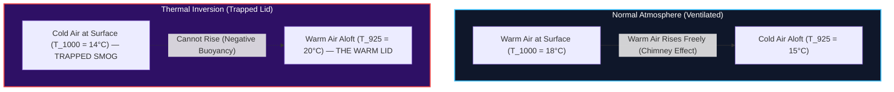

# In-Depth Scientific & Technical Guide: Thermal Inversion Watch
## *Sounding Diagnostics, Lapse Rates, and Atmospheric Trapping Lids*

---

## 1. Executive Summary: What is "Inversion Watch"?

In meteorology and atmospheric chemistry, **Thermal Inversion** is the single most decisive weather phenomenon determining whether Delhi's air quality is clean or hazardous.

### The Physical Mechanism:
1. **Normal Lapse Rate (Daytime / Clean Conditions)**:
   - Sunlight heats the earth's surface. Air is warmest at ground level and cools with height ($\Gamma > 0$).
   - Because warm air is less dense than cold air, ground air naturally rises into the sky, carrying vehicle emissions and dust away like a giant chimney (**Active Vertical Ventilation**).
2. **Thermal Inversion (Nighttime / Severe Smog Trap)**:
   - During clear winter nights, the ground rapidly radiates its heat out to space, cooling the surface air below the temperature of the air above it.
   - Upper air ($925\,\text{hPa}$) becomes **warmer than ground air ($1000\,\text{hPa}$)**: $\Delta T = T_{925} - T_{1000} > 0$.
   - Cold, heavy air is trapped underneath warm, light air. Convection completely stops. A rigid **"thermal lid"** seals the city, trapping all toxic smoke within $150\text{ to }200\,\text{meters}$ of the ground!

---

## 2. Mathematical Equations & Diagnostics Explained

### 1. Temperature Gradient: $\Delta T$ ($925\text{–}1000\,\text{hPa}$)
* **Source Code**: `backend/app/physics/inversion_engine.py` $\rightarrow$ `compute_inversion_series()`
* **Formula**:
  $$\Delta T = T(925\,\text{hPa}) - T(1000\,\text{hPa})$$
* **Standard Atmospheric Pressure Levels**:
  - $1000\,\text{hPa}$: Ground surface level ($\approx 100\text{--}200\,\text{m}$ ASL).
  - $925\,\text{hPa}$: Lower troposphere level ($\approx 750\,\text{m}$ AGL).
* **Physical Interpretation**:
  - $\Delta T < 0^\circ\text{C}$ (e.g. **`−3.0°C`**): Upper air is colder than ground air. Air is buoyant and well-mixed.
  - $\Delta T > 0^\circ\text{C}$ (e.g. **`+4.5°C`**): Upper air is warmer than ground air. A rigid thermal lid is active!

---

### 2. Environmental Lapse Rate ($\Gamma$ in $\text{K/km}$)
* **Formula**:
  $$\Gamma = -\frac{dT}{dz} = -\frac{T(925\,\text{hPa}) - T(1000\,\text{hPa})}{\Delta z}$$
  Where $\Delta z = 0.75\,\text{km}$ (thickness between $1000\,\text{hPa}$ and $925\,\text{hPa}$).
* **Calculation for $\Delta T = -3.0^\circ\text{C}$**:
  $$\Gamma = -\frac{-3.0^\circ\text{C}}{0.75\,\text{km}} = +4.0\,\text{K/km}$$
* **What the sign means**:
  - $\Gamma > 0$ (**`+4.0 K/km`**): Temperature decreases by $4^\circ\text{C}$ per kilometer of altitude (normal, convective atmosphere).
  - $\Gamma < 0$ (e.g. **`−6.0 K/km`**): Inverted atmosphere (temperature increases with altitude).

---

### 3. Inversion Severity Classification Scale

Our system classifies thermal inversions using boundary-layer meteorology standards:

| $\Delta T$ Range ($^\circ\text{C}$) | Severity Level | Atmospheric Behavior | Color on Dashboard |
| :---: | :---: | :--- | :---: |
| $\Delta T < +1.5^\circ\text{C}$ | **None (Normal Lapse)** | Convective mixing; clean vertical dispersion | 🔵 Cyan / Blue |
| $+1.5^\circ\text{C} \le \Delta T < +3.5^\circ\text{C}$ | **Weak Inversion** | Slight nocturnal stratification | 🟡 Yellow / Amber |
| $+3.5^\circ\text{C} \le \Delta T < +6.0^\circ\text{C}$ | **Moderate Inversion** | Moderate lid; emissions begin accumulating | 🟠 Orange |
| $\Delta T \ge +6.0^\circ\text{C}$ | **Strong Inversion** | Extreme capping lid; severe pollution trapping | 🟣 Magenta / Red |

---

### 4. Hours With a Lid (`0 of 72`)
* **What it does**: Scans every hour in the 72-hour forecast horizon and counts the total hours where $\Delta T \ge +1.5^\circ\text{C}$.
* **`0 of 72`**: Indicates that throughout the entire 3-day forecast period, Delhi's atmosphere remains well-ventilated with no persistent capping inversion.

---

### 5. The 72-Hour Vertical Bar Strip
* **What it visualizes**:
  - Each vertical bar represents one hour across the 3-day timeline ($0\text{ to }72\,\text{hours}$).
  - Bar heights dynamically reflect the thermal stability profile.
  - **Cyan/Blue bars**: Normal lapse rate (active vertical ventilation).
  - **Orange/Magenta bars**: Inversion lids trapping nocturnal emissions.

---

## 3. Summary Table of Readout Cards

| Card Name | Displayed Value | Mathematical Formula | Physical Meaning |
| :--- | :---: | :--- | :--- |
| **$\Delta T$ at Cursor** | `−3.0 °C` | $T_{925\,\text{hPa}} - T_{1000\,\text{hPa}}$ | Upper air is $3^\circ\text{C}$ cooler than surface air. |
| **Severity** | `None (Normal Lapse)` | Threshold classification of $\Delta T$ | No capping lid; atmosphere is buoyant and well-mixed. |
| **Lapse Rate** | `+4.0 K/km` | $-\Delta T / 0.75\,\text{km}$ | Normal cooling rate of $4^\circ\text{C}$ per kilometer. |
| **Hours With a Lid** | `0 of 72` | $\sum (\Delta T \ge 1.5^\circ\text{C})$ | Total hours under active thermal trapping across 3 days. |

---

## 4. Summary Presentation Takeaway

> **"Inversion Watch is Delhi's early warning system for atmospheric traps. By tracking temperature differences between pressure levels, we detect the moment a warm lid forms over the city before ground-level pollution spikes, giving authorities and citizens a predictive 72-hour forecast of air stagnation."**
