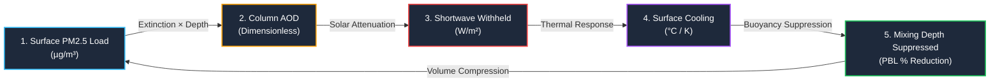

# In-Depth Scientific & Technical Guide: The Return Leg
## *Two-Way Aerosol–Boundary Layer Coupling: Chemistry Pushing Back on the Weather*

---

## 1. Executive Summary: What is "The Return Leg"?

In standard operational air quality models (such as conventional WRF-Chem or Gaussian dispersion models), meteorology is treated as a **one-way street**:
$$\text{Weather Model (Temperature, Wind, PBL Height)} \xrightarrow{\text{One-Way}} \text{Air Quality Model (Pollutant Concentrations)}$$

In this traditional view, the weather dictates the air quality, but the air pollution has **zero effect on the weather**. The boundary layer height ($h$) dilutes the pollution ($C = \text{Mass} / h$), and the model stops there.

### The Real-World Atmospheric Problem
In reality, atmospheric physics is a **closed, two-way coupled loop**:
1. High emissions create a dense surface layer of **$\text{PM}_{2.5}$ aerosols**.
2. These microscopic particles scatter and absorb incoming sunlight (**Aerosol Optical Depth / AOD**).
3. Less solar shortwave radiation reaches the ground (**Surface Dimming / Solar Withheld**).
4. The ground cools down relative to the warmer air aloft (**Surface Cooling / Radiative Inversion**).
5. Thermal buoyancy and vertical turbulent mixing weaken, **suppressing the Planetary Boundary Layer (PBL)** to a much shallower height.
6. The shallower lid squeezes emissions into an even smaller volume, **driving $\text{PM}_{2.5}$ even higher**, which dims the sun even further!

This self-reinforcing positive feedback mechanism is what turns moderate winter pollution in Delhi NCR into **catastrophic, multi-day severe smog traps**. In our project, this section is titled **"The Return Leg"** because it represents **chemistry pushing back on the meteorology**.

---

## 2. Step-by-Step Mathematical & Physical Formulation

Our system simulates this coupling dynamically using physics kernels implemented in [`backend/app/physics/box_model.py`](file:///c:/Users/aswin/Downloads/delhi_ncr_aqi_project%20%281%29/backend/app/physics/box_model.py) and [`backend/app/physics/inversion_engine.py`](file:///c:/Users/aswin/Downloads/delhi_ncr_aqi_project%20%281%29/backend/app/physics/inversion_engine.py).



---

### Step 1: Surface $\text{PM}_{2.5}$ Load ($\mu\text{g}/\text{m}^3$)
* **Location in Code**: `box_model.step()` in `backend/app/physics/box_model.py`
* **What it represents**: The active concentration of fine inhalable particulate matter ($\le 2.5\,\mu\text{m}$) in the surface mixed layer.
* **Governing Equation (Mass Conservation)**:
  $$\frac{dm_{\text{mixed}}}{dt} = E_{\text{emis}}(t) - \frac{m_{\text{mixed}} - m_{\text{bg}}}{\tau_{\text{loss}}} + \text{Entrainment}(t)$$
  Where:
  - $m_{\text{mixed}} = C \cdot h$ (column mass in $\mu\text{g}/\text{m}^2$).
  - $E_{\text{emis}}(t)$: Hourly diurnal emission flux (traffic, power plants, domestic burning).
  - $\tau_{\text{loss}}$: Combined removal timescale combining dry deposition and horizontal advection:
    $$\frac{1}{\tau_{\text{loss}}} = \frac{1}{\tau_{\text{deposition}}} + \frac{U_{\text{wind}}}{L_{\text{city}}}$$
    ($L_{\text{city}} = 40\,\text{km}$, the spatial scale of Delhi National Capital Region).

---

### Step 2: Aerosol Optical Depth ($\text{AOD}$, Dimensionless)
* **Location in Code**: `aerosol_optical_depth()` in `backend/app/physics/inversion_engine.py`
* **What it represents**: The total extinction of light by airborne aerosols integrated throughout the atmospheric column.
* **Governing Equation**:
  $$\text{AOD} = \text{MEE} \times \eta_{\text{column}} \times \left(\text{PM}_{2.5} \times 10^{-6}\right) \times h_{\text{PBL}}$$
* **Physical Constants Used**:
  - $\text{MEE} = 8.0\,\text{m}^2/\text{g}$ (**Mass Extinction Efficiency**): Dry fine-mode urban aerosol has an MEE of $\sim 4\,\text{m}^2/\text{g}$. Under Delhi's humid winter nights ($70\%\text{--}90\%\,\text{RH}$), hygroscopic water uptake swells the particles to twice their optical cross-section, raising MEE to $8.0\,\text{m}^2/\text{g}$.
  - $\eta_{\text{column}} = 1.5$ (**Column Enhancement Factor**): Aerosols are not restricted to the surface layer; residual smoke layers aloft also attenuate incoming solar radiation.
  - $10^{-6}$: Conversion factor from $\mu\text{g}/\text{m}^3$ to $\text{g}/\text{m}^3$.
  - $\text{AOD}_{\max} = 3.0$: Upper physical ceiling to prevent numerical divergence.

---

### Step 3: Shortwave Radiation Withheld ($\Delta\text{SW}$ in $\text{W}/\text{m}^2$)
* **Location in Code**: `shortwave_reduction()` in `backend/app/physics/inversion_engine.py`
* **What it represents**: The amount of solar heating prevented from reaching the ground due to aerosol absorption and back-scattering.
* **Governing Equation**:
  $$\Delta\text{SW} = -\text{SW}_{\text{incoming}} \times \min\left(\alpha_{\max},\, \beta_{\text{atten}} \times \text{AOD}\right)$$
* **Physical Parameters**:
  - $\text{SW}_{\text{incoming}}$: Incoming direct + diffuse clear-sky solar irradiance from meteorological satellite forecasts.
  - $\beta_{\text{atten}} = 0.13$: Clear-sky aerosol forcing efficiency per unit AOD over the Indo-Gangetic Plain.
  - $\alpha_{\max} = 0.45$: Saturation threshold (diffuse forward scattering allows a minimum portion of light through even in dense haze).
  - **Nighttime Truth**: At night, $\text{SW}_{\text{incoming}} = 0$, so $\Delta\text{SW} = 0\,\text{W}/\text{m}^2$.

---

### Step 4: Surface Cooling ($\Delta T_{\text{surface}}$ in $^\circ\text{C}$ / $\text{K}$)
* **Location in Code**: `surface_cooling_from_sw()` & Thermal Memory Kernel in `backend/app/physics/inversion_engine.py`
* **What it represents**: The drop in ground surface temperature due to withheld solar heating.
* **Governing Equation (Instantaneous Daytime Cooling)**:
  $$\Delta T_{\text{instant}} = \Delta\text{SW} \times \kappa_{\text{thermal}}$$
  Where $\kappa_{\text{thermal}} = 0.02\,\text{K}/(\text{W}/\text{m}^2)$ (produces $\sim 2.0\,\text{K}$ cooling under $-100\,\text{W}/\text{m}^2$ aerosol forcing).

#### The Nighttime Memory Kernel (Crucial Innovation)
At 02:00 AM, the sun is down ($\Delta\text{SW} = 0$). How does the feedback loop stay active at night?
The earth's soil and urban asphalt possess **thermal inertia**. An afternoon spent under dense smog deprives the ground of heat, so the surface enters sunset already pre-cooled. We model this as an exponential thermal memory decay:
$$\Delta T_{\text{carry}}(t+1) = \Delta T_{\text{effective}}(t) \cdot \exp\left(-\frac{\Delta t}{\tau_{\text{memory}}}\right)$$
Where $\tau_{\text{memory}} = 8.0\,\text{hours}$.
$$\Delta T_{\text{effective}}(t) = \max\left(\Delta T_{\text{instant}}(t),\, \Delta T_{\text{carry}}(t)\right)$$

---

### Step 5: Mixing Depth Suppression ($\%$ & New PBL Height)
* **Location in Code**: `pbl_from_stability()` in `backend/app/physics/inversion_engine.py`
* **What it represents**: The reduction in the convective boundary layer depth due to reduced surface buoyancy flux.
* **Governing Equation**:
  $$h_{\text{perturbed}} = h_{\text{observed}} \times \exp\left(-\lambda \cdot \Delta T_{\text{effective}}\right)$$
  Where $\lambda = 0.15\,\text{K}^{-1}$ ($\sim 20\%$ boundary layer compression per $1.5\,\text{K}$ of surface cooling).
* **Suppression Percentage**:
  $$\text{PBL Suppression } (\%) = \left(\frac{h_{\text{observed}} - h_{\text{perturbed}}}{h_{\text{observed}}}\right) \times 100\%$$
* **Identity Property Guarantee**: When $\Delta T = 0$, $\exp(0) = 1$, so $h_{\text{perturbed}} \equiv h_{\text{observed}}$.

---

## 3. How We Solve the Loop: Picard Fixed-Point Iteration

Because mixing depth $h$ determines $\text{PM}_{2.5}$, and $\text{PM}_{2.5}$ determines $h$, this is a circular dependency:
$$h = \mathcal{F}(h)$$

To solve this non-linear system without unstable oscillations or artificial drift, our backend executes **Picard Fixed-Point Iteration with Under-Relaxation**:

```python
# From backend/app/services/aqi_service.py (_solve_coupled_hour)
h = pbl_observed_m
for it in range(1, _MAX_PICARD_ITER + 1):
    trial = col.clone() # Trial-step a clone to preserve mass budget
    conc = box_model.step(trial, h, dt_s, emis_scale, wind_ms, season, plume_pm25)
    
    aod = aerosol_optical_depth(conc[Pollutant.PM25], h)
    d_sw = shortwave_reduction(aod, solar_w_m2)
    cooling_instant = -surface_cooling_from_sw(d_sw)
    cooling_eff = max(cooling_instant, cooling_carry_k)
    
    h_target = pbl_from_stability(pbl_observed_m, cooling_eff)
    
    # Under-relaxation (alpha = 0.6) prevents oscillatory divergence
    h_next = 0.6 * h_target + 0.4 * h
    
    if abs(h_next - h) < 1.0: # Convergence tolerance: 1.0 meter
        h = h_next
        break
    h = h_next
```

* **Convergence Speed**: The UI displays **"1 Picard iteration to converge"** during stable equilibrium periods, and **"2 to 4 iterations"** during rapidly shifting morning sunrise or intense stubble-plume fumigation events.

---

## 4. Summary Table of Variables and Data Sources

| Displayed Metric | Symbol | Formula | Units | Real-Time Data Source |
| :--- | :---: | :--- | :---: | :--- |
| **Surface Load** | $\text{PM}_{2.5}$ | Prognostic slab mass / depth ($m/h$) | $\mu\text{g}/\text{m}^3$ | 43-Station CPCB Continuous Monitors + Ensemble Forecast |
| **AOD** | $\tau_{\text{aerosol}}$ | $\text{MEE} \times 1.5 \times \text{PM}_{2.5} \times h \times 10^{-6}$ | — | Derived physically; validated against MODIS / AERONET |
| **Shortwave Withheld** | $\Delta\text{SW}$ | $-\text{SW}_{\text{in}} \times \min(0.45, 0.13 \times \text{AOD})$ | $\text{W}/\text{m}^2$ | Open-Meteo Solar Radiation API ($0\text{--}1000\,\text{W}/\text{m}^2$) |
| **Surface Cooling** | $\Delta T$ | $\Delta\text{SW} \times 0.02\,\text{K}/(\text{W}/\text{m}^2)$ | $^\circ\text{C}$ | Derived from surface energy balance + 8h thermal memory |
| **Mixing Depth** | $\Delta h / h$ | $\left(1 - \exp(-0.15 \cdot \Delta T)\right) \times 100$ | $\%$ | Open-Meteo $925\,\text{hPa}\text{--}1000\,\text{hPa}$ Pressure Levels |
| **Picard Iterations** | $N$ | Fixed-point convergence counter | Int | Solved at runtime by `_solve_coupled_hour()` |

---

## 5. Summary Takeaway for Presentation & Review

> **"The Return Leg demonstrates that Delhi's smog is not simply passive dirt suspended in air; it is an active thermodynamic agent. By blocking sunlight, the smog creates its own inversion layer, cementing itself to the ground in a self-perpetuating trap until regional winds break the cycle."**
